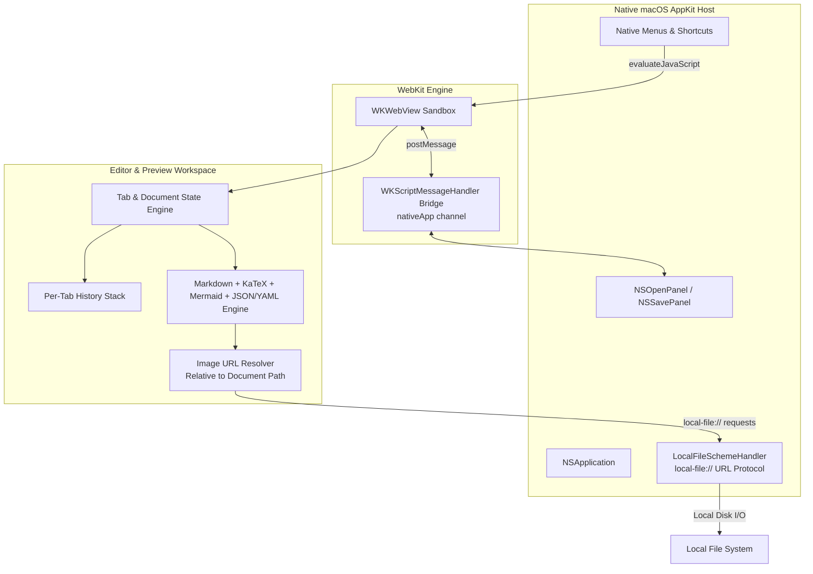

# Architecture & Technical Design

Markdown Viewer combines a native Swift AppKit desktop host with a sandboxed WebKit rendering engine.

---

## 1. Bidirectional AppKit and WebKit Bridge

- **Swift to JavaScript**: Native menu actions (Undo, Redo, Save, Close Tab, Close Window, Quit, Open) trigger Swift methods that evaluate JavaScript functions on the active `WKWebView` instance (e.g. `window.promptDirtySaveOnWindowClose()`, `window.editorUndo()`, `window.openDocumentFromHost()`).
- **JavaScript to Swift**: State changes in the frontend post messages via `window.webkit.messageHandlers.nativeApp.postMessage({...})`:
  - `documentEdited`: Notifies AppKit of modified document state to toggle the native window edited dot.
  - `saveFile` / `saveMultipleFiles`: Invokes `NSSavePanel` or writes directly to disk.
  - `reloadTabFromFile`: Reads fresh contents from disk when restoring file-backed tabs.
  - `didFinishSavingAllDirtyDocuments`: Signals completion of batch save prompts during window close or app termination.

---

## 2. Local Media & Image Resolution (`local-file://`)

- **Relative Image Resolution**: When a Markdown file is opened from disk (e.g. `project/README.md`), relative image paths (e.g. `docs/assets/icon.png` or `../images/diagram.png`) are resolved relative to the document's canonical directory path.
- **Custom Scheme Handler**: To avoid WebKit cross-origin file URL restrictions, local images are mapped to `local-file:///path/to/image.png`. The Swift host implements `WKURLSchemeHandler` (`LocalFileSchemeHandler`) to stream image data directly from disk with appropriate MIME types (`image/png`, `image/jpeg`, `image/svg+xml`, `image/webp`).
- **Sanitization Integrity**: DOMPurify is configured with `ALLOWED_URI_REGEXP` to whitelist the `local-file:` protocol, preventing image sources from being stripped while preserving protection against malicious scripts.

---

## 3. Document Safety & Continuation State Machine

- **Per-Tab Dirty State**: Active edits in the textarea are compared against `savedContent`. Dirty state is indicated by a yellow status dot and tab title indicator (`●`).
- **Continuation Workflow**: Window closing (<kbd>Shift</kbd>+<kbd>Cmd</kbd>+<kbd>W</kbd>) and application quit (<kbd>Cmd</kbd>+<kbd>Q</kbd>) use an asynchronous continuation state machine (`PendingSaveContinuation`), ensuring all modified tabs prompt the user before the window or process terminates.

---

## 4. State Persistence & Startup Restoration

- **Isolated Storage**: Open tabs, active document ID, view modes, and font preferences are persisted in `localStorage`.
- **Startup Guard**: Startup initialization is protected by an `isRestoring` guard to prevent empty editor instances from overwriting saved tab content before views are fully rendered.
