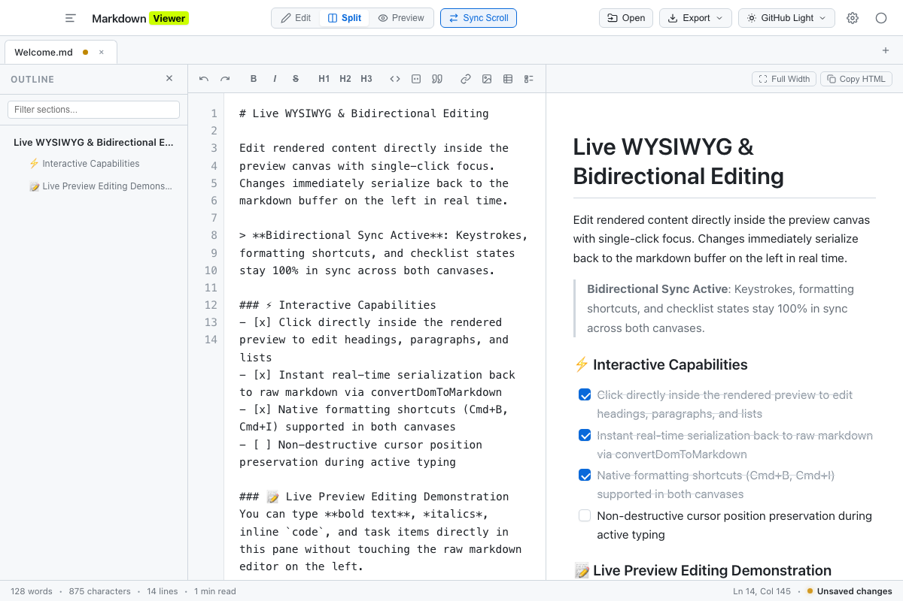
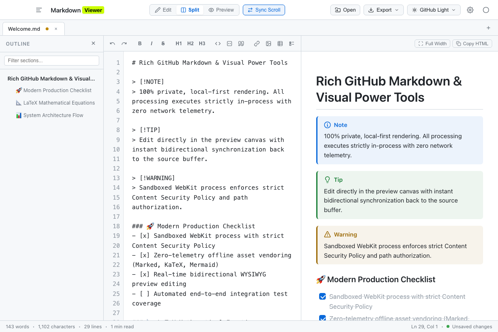

# Markdown Viewer

[](https://github.com/jomalaca/markdown-viewer/releases)
[](LICENSE)
[](https://apple.com/macos)
[](#)

A fast, private, local-first macOS desktop application and editor for Markdown, JSON, and YAML documents. Built with zero tracking telemetry, 100% vendored offline libraries, and instant bidirectional preview editing.

---

## Installation

### Homebrew Cask (Recommended)

Install the signed desktop application bundle:

```bash
brew install --cask jomalaca/tap/markdown-viewer
```

### Homebrew Formula (Source Build, Gatekeeper-Free)

Compile directly on your machine via standard macOS Command Line Tools (no full Xcode installation required):

```bash
brew install jomalaca/tap/markdown-viewer
```

### Direct Download

Download the latest release archive (`MarkdownViewer-macOS.zip`) directly from [GitHub Releases](https://github.com/jomalaca/markdown-viewer/releases). Unzip and drag `Markdown Viewer.app` to your `/Applications` folder.

### Build from Source

```bash
# Clone the repository
git clone https://github.com/jomalaca/markdown-viewer.git
cd markdown-viewer

# Compile the native macOS application bundle
./scripts/build_macos.sh

# Launch the app
open "build/Markdown Viewer.app"
```

---

## Command-Line Interface (CLI)

Launch files or pipe terminal streams directly into new tabs:

```bash
# Open one or more files in tabs
markdown-viewer README.md package.json

# Pipe shell output directly into a new tab
cat /var/log/system.log | markdown-viewer
git diff | markdown-viewer
```

---

## Featured Highlights

### 1. Live WYSIWYG & Bidirectional Editing

Edit rendered content directly inside the preview canvas with single-click focus. Changes instantly sync back to the underlying markdown buffer and undo/redo stacks, with full support for native formatting shortcuts (<kbd>Cmd</kbd>+<kbd>B</kbd>, <kbd>Cmd</kbd>+<kbd>I</kbd>) and interactive checklist toggles.



### 2. Rich GitHub Markdown & Visual Power Tools

Render full GitHub Flavored Markdown with styled GitHub Alert callouts (`[!NOTE]`, `[!TIP]`, `[!IMPORTANT]`, `[!WARNING]`, `[!CAUTION]`), custom 16px interactive checkboxes, KaTeX mathematical notation, Mermaid flowcharts, and a searchable outline sidebar (<kbd>Shift</kbd>+<kbd>Cmd</kbd>+<kbd>O</kbd>).



---

## Supported Formats

- **GitHub Flavored Markdown (GFM)**: Tables, task lists, strikethrough, autolinks, alerts, and bidirectional preview editing.
- **LaTeX Math (KaTeX)**: Inline equations (`$E = mc^2$`) and display formulas (`$$\int_0^\infty e^{-x^2} dx$$`).
- **Mermaid Diagrams**: Flowcharts, sequence diagrams, state machines, and class diagrams rendered directly from code fences.
- **Structured Data (JSON & YAML)**: Automatic syntax detection, formatted code view, interactive collapsible tree viewer, and outline navigation.

---

[Architecture](ARCHITECTURE.md) &nbsp;•&nbsp; [Releases](https://github.com/jomalaca/markdown-viewer/releases) &nbsp;•&nbsp; [MIT License](LICENSE)
