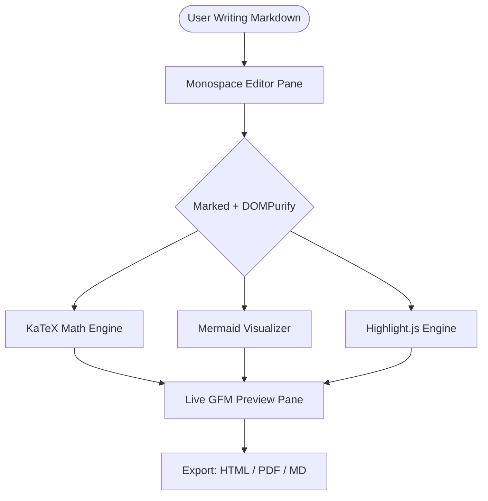
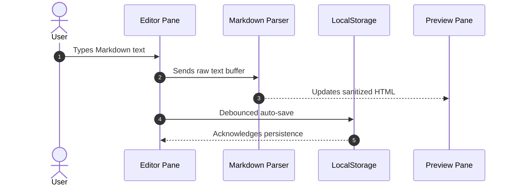

# 🧪 Kitchen Sink Feature Parity Benchmark

This document tests every core GitHub Flavored Markdown (GFM), math, diagram, and typography feature across **Markdown Viewer** and your clone. 
  
---

## 1. Typography & Inline Styles

Here is a paragraph testing various inline styles:
- **Bold text** with `**asterisks**` and __bold text__ with `__underscores__`
- *Italic text* with `*asterisks*` and _italic text_ with `_underscores_`
- ***Bold and italic combined*** with `***three asterisks***`
- ~~Strikethrough text~~ with `~~tildes~~`
- `Inline code block` with backticks
- Keyboard shortcut styling: <kbd>Cmd</kbd> + <kbd>Shift</kbd> + <kbd>P</kbd>
- Subscript H<sub>2</sub>O and Superscript E = mc<sup>2</sup>
- Text highlighting: <mark>Highlighted note</mark>

---

## 2. Heading Hierarchy & Anchor Links

# Heading 1 (Page Title Level)
## Heading 2 (Major Section)
### Heading 3 (Subsection)
#### Heading 4 (Component Level)
##### Heading 5 (Minor Header)
###### Heading 6 (Deep Detail)

---

## 3. Blockquotes & Nested Quotes

> "Simplicity is prerequisite for reliability."
> — Edsger W. Dijkstra
>
> > Nested quote: "There are two ways of constructing a software design: One way is to make it so simple that there are obviously no deficiencies..."
> > — C.A.R. Hoare

---

## 4. GitHub Flavored Task Lists (Checklists)

- [x] Test basic inline typography
- [x] Test heading hierarchy
- [ ] Test interactive checkbox clicking in preview
- [ ] Verify state updates accurately in source editor
- [x] Test table rendering and alignment
- [ ] Test KaTeX math expressions
- [ ] Test Mermaid flowchart rendering

---

## 5. Lists: Ordered, Unordered & Nested

### Unordered List with Mixed Levels
* Frontend Architecture
  * View Layer (React, Vue, Native DOM)
  * Parsing Engine
    * Tokenizer
    * HTML Sanitizer (`DOMPurify`)
* Data Storage
  * `localStorage`
  * IndexedDB
* Export Pipeline
  * Standalone HTML
  * Clean Print PDF

### Ordered List with Task Sub-steps
1. Clone the repository
2. Open `index.html` in browser
3. Paste Markdown content
4. Choose export format:
   1. Markdown (.md)
   2. Standalone HTML
   3. PDF via Print

---

## 6. Comprehensive Tables (GFM)

### Feature Comparison Matrix

| Feature Specification | Left-Aligned | Center-Aligned | Right-Aligned | Status |
| :--- | :--- | :---: | ---: | :---: |
| GFM Table Support | Standard markdown | Centered text | \$149.99 | ✅ Pass |
| Syntax Highlighting | Auto-detected | Multi-language | 45 ms | ✅ Pass |
| KaTeX Math Engine | Inline & Display | Full LaTeX | 100% | ✅ Pass |
| Mermaid Diagrams | SVG Vector | Dynamic | 0 ms | ✅ Pass |
| Local Storage Save | `localStorage` | Client-only | Instant | ✅ Pass |

---

## 7. Syntax Highlighted Code Blocks

### JavaScript (ES2024 Modern)
```javascript
// Reactive debounce helper
function debounce(fn, delayMs = 300) {
  let timer = null;
  return (...args) => {
    clearTimeout(timer);
    timer = setTimeout(() => fn(...args), delayMs);
  };
}

const autoSaver = debounce((docId, text) => {
  console.log(`Document ${docId} safely stored locally (${text.length} chars).`);
}, 250);
```

### Python 3
```python
from dataclasses import dataclass
from typing import List, Optional

@dataclass
class DocumentTab:
    id: str
    title: str
    content: str
    is_modified: bool = False

def search_tabs(tabs: List[DocumentTab], query: str) -> List[DocumentTab]:
    """Return all tabs matching a search term."""
    return [tab for tab in tabs if query.lower() in tab.title.lower()]
```

### Rust
```rust
pub struct MarkdownDocument {
    pub title: String,
    pub body: String,
    pub word_count: usize,
}

impl MarkdownDocument {
    pub fn new(title: &str, body: &str) -> Self {
        let words = body.split_whitespace().count();
        Self {
            title: title.to_string(),
            body: body.to_string(),
            word_count: words,
        }
    }
}
```

---

## 8. LaTeX Math Expressions (KaTeX)

Inline math formula: Einstein's relationship $E = mc^2$, the quadratic solution $x = \frac{-b \pm \sqrt{b^2 - 4ac}}{2a}$, and Euler's formula $e^{i\pi} + 1 = 0$.

Display Block Formula:

$$
\int_{-\infty}^{\infty} e^{-x^2} dx = \sqrt{\pi}
$$

Matrix Arithmetic:

$$
\mathbf{A} = \begin{pmatrix}
a_{11} & a_{12} & a_{13} \\
a_{21} & a_{22} & a_{23} \\
a_{31} & a_{32} & a_{33}
\end{pmatrix}
$$

Summation & Limits:

$$
\lim_{x \to 0} \frac{\sin x}{x} = 1 \quad \text{and} \quad \sum_{n=1}^{\infty} \frac{1}{n^2} = \frac{\pi^2}{6}
$$

---

## 9. Mermaid Diagrams

### Architecture Flowchart


### Sequence Flow


---

## 10. Collapsible Content & Footnotes

<details>
<summary><strong>Click to expand hidden developer notes</strong></summary>

> Here is hidden technical documentation that can be toggled by the user.
> Useful for FAQs, appendices, and reference material.

</details>

Footnotes test: Markdown is an intuitive syntax[^1] created by John Gruber and Aaron Swartz[^2].

[^1]: Markdown format specification first released in 2004.
[^2]: Designed to be readable in raw text form without tags.
