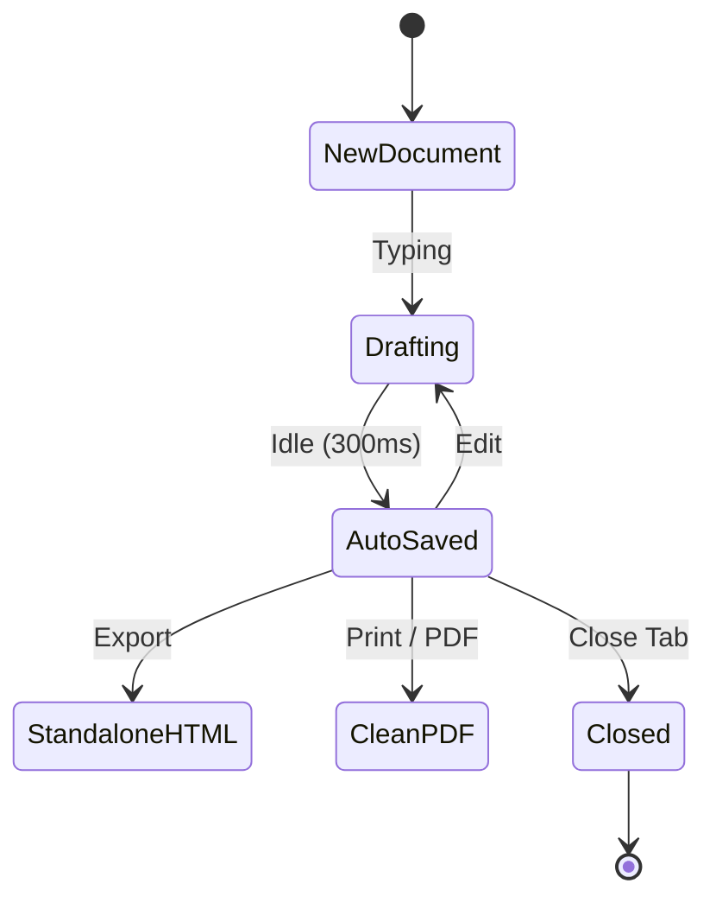
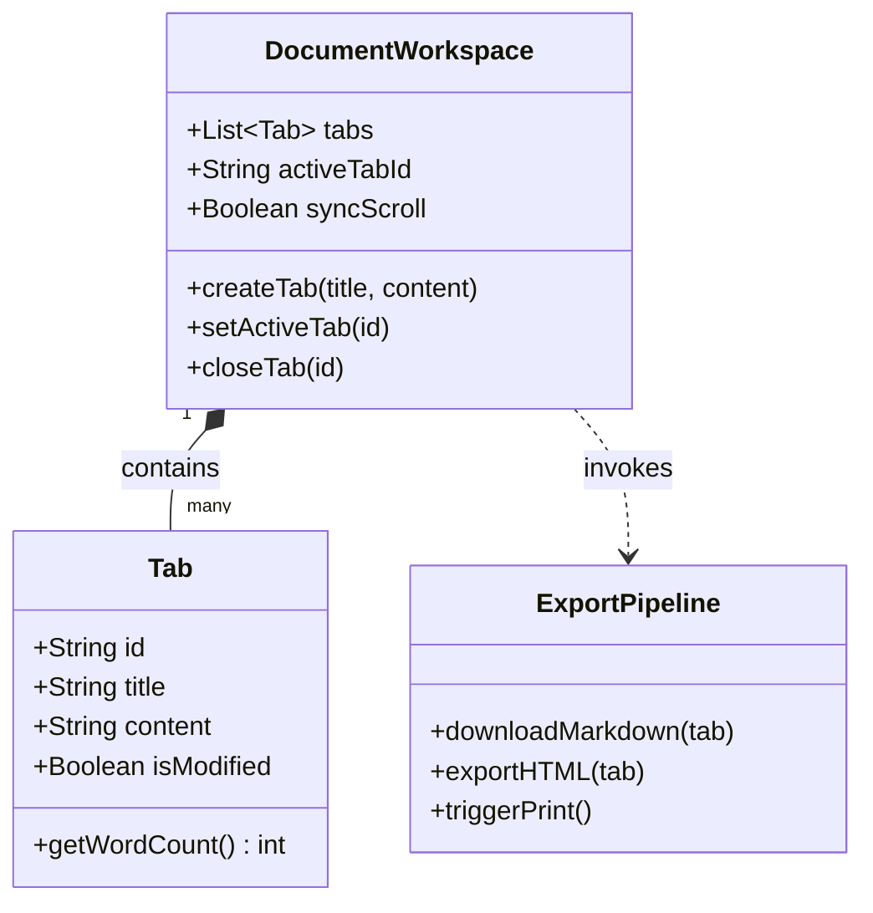
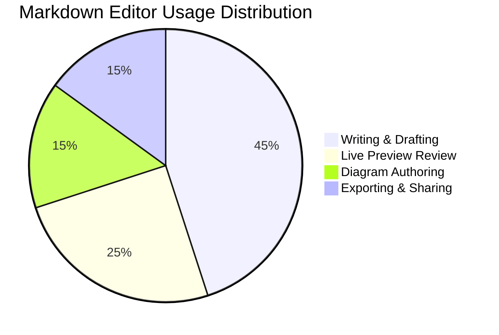
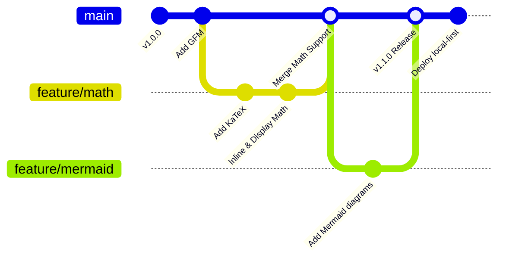

# 📐 Advanced Math & Mermaid Diagrams Benchmark

This file stress-tests advanced mathematical equations via KaTeX and various Mermaid diagram types.

---

## Part 1: Advanced KaTeX Mathematics

### 1. Maxwell's Equations of Electrodynamics

$$
\begin{aligned}
\nabla \cdot \mathbf{E} &= \frac{\rho}{\varepsilon_0} && \text{(Gauss's Law)} \\
\nabla \cdot \mathbf{B} &= 0 && \text{(Gauss's Law for Magnetism)} \\
\nabla \times \mathbf{E} &= -\frac{\partial \mathbf{B}}{\partial t} && \text{(Faraday's Law of Induction)} \\
\nabla \times \mathbf{B} &= \mu_0 \mathbf{J} + \mu_0 \varepsilon_0 \frac{\partial \mathbf{E}}{\partial t} && \text{(Ampère-Maxwell Law)}
\end{aligned}
$$

### 2. Piecewise Defined Function

$$
f(x) = \begin{cases}
x^2 \sin\left(\frac{1}{x}\right) & \text{if } x \neq 0 \\
0 & \text{if } x = 0
\end{cases}
$$

### 3. Greek Letters & Series Expansions

Taylor expansion of $\cos(x)$ around $a = 0$:

$$
\cos(x) = \sum_{k=0}^{\infty} \frac{(-1)^k}{(2k)!} x^{2k} = 1 - \frac{x^2}{2!} + \frac{x^4}{4!} - \frac{x^6}{6!} + \cdots
$$

---

## Part 2: Diverse Mermaid Diagrams

### 1. State Diagram (Lifecycle of a Document)

### 2. Class Diagram (Object-Oriented Design)

### 3. Pie Chart (Time Allocation)

### 4. Git Graph (Branching & Releases)

